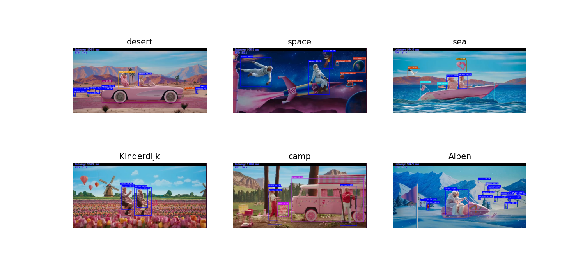

## Introduction 
- Containers are a form of operating system virtualization. However, containers do not contain operating system images. This makes them more lightweight and portable, with significantly less overhead.

-  A container includes all the necessary executables, binary codes, libraries, and configuration files. Therefore, it can be run anything from a small microservice or software process to a larger application.

- In large-scale application deployments, multiple containers may be deployed as one or more container clusters. Such clusters might be managed by a container orchestrator such as Docker Swarm, Kubernetes.

In a nutshell, using containers could be more streamlined to build, test, and deploy the applications on multiple environments, from a developer’s local laptop to an on-premises data center and even the cloud.


## Build

First, you will need [git](https://git-scm.com/) to clone this repository to your local computer. If you’re using Linux system like Ubuntu, you can simply do this by:
```
sudo apt-get install git
```

Next, clone the repo:
```
git clone https://github.com/jonathanyeh0723/openvino-with-docker
```

After that, go to the main folder with Dockerfile inside:
```
cd openvino-with-docker/
```

To build the image, run
```
docker build . --build-arg package_url=https://storage.openvinotoolkit.org/repositories/openvino/packages/2023.0/linux/l_openvino_toolkit_ubuntu20_2023.0.0.10926.b4452d56304_x86_64.tgz -t dockerflamejc/advanipc:latest --no-cache
```

The above commands would build an image from a Dockerfile:<br>
- `docker build .`: This is the default option to look for a Dockerfile at the root of the build context.<br>
- `--build-arg`: Set the build-time variables, in this case is `package_url`. It points to the OpenVINO dev packages directly from [public storage](https://storage.openvinotoolkit.org/repositories/openvino/packages/).<br>
- `-t`: Name and optionally a tag in the name:tag format for easier identify our image.<br>
- `--no-cache`: For sake of hardened microservice security, not to use cache when building the image.

Reference of successful build logs:
```
[+] Building 1194.8s (53/53) FINISHED                                                                                                                         
 => [internal] load build definition from Dockerfile                                                                                                     0.0s
 => => transferring dockerfile: 14.59kB                                                                                                                  0.0s
 => [internal] load .dockerignore                                                                                                                        0.0s
 => => transferring context: 2B                                                                                                                          0.0s
 => [internal] load metadata for docker.io/library/ubuntu:22.04                                                                                          1.6s
 => [auth] library/ubuntu:pull token for registry-1.docker.io                                                                                            0.0s
 => [internal] load build context                                                                                                                        0.1s
 => => transferring context: 22.96MB                                                                                                                     0.1s
 => CACHED [base 1/8] FROM docker.io/library/ubuntu:22.04@sha256:0bced47fffa3361afa981854fcabcd4577cd43cebbb808cea2b1f33a3dd7f508                        0.0s
 => CACHED https://storage.openvinotoolkit.org/repositories/openvino/packages/2023.0/linux/l_openvino_toolkit_ubuntu20_2023.0.0.10926.b4452d56304_x86_6  1.0s
 => [ov_base  2/34] RUN sed -ri -e 's@^UMASK[[:space:]]+[[:digit:]]+@UMASK 000@g' /etc/login.defs &&  grep -E "^UMASK" /etc/login.defs && useradd -ms /  0.3s
 => [base 2/8] RUN apt-get update &&     apt-get install -y --no-install-recommends curl tzdata ca-certificates &&     rm -rf /var/lib/apt/lists/*      12.2s
 => [ov_base  3/34] RUN mkdir /opt/intel                                                                                                                 0.3s
 => [base 3/8] WORKDIR /tmp/openvino_installer                                                                                                           0.1s 
 => [base 4/8] ADD https://storage.openvinotoolkit.org/repositories/openvino/packages/2023.0/linux/l_openvino_toolkit_ubuntu20_2023.0.0.10926.b4452d563  0.3s 
 => [base 5/8] RUN useradd -ms /bin/bash -G users openvino                                                                                               0.2s 
 => [base 6/8] RUN tar -xzf "/tmp/openvino_installer"/*.tgz &&     OV_BUILD="$(find . -maxdepth 1 -type d -name "*openvino*" | grep -oP '(?<=_)\d+.\d+.  1.2s 
 => [base 7/8] RUN rm -rf /opt/intel/openvino/.distribution && mkdir /opt/intel/openvino/.distribution &&     touch /opt/intel/openvino/.distribution/d  0.4s 
 => [opencv 1/7] RUN apt-get update;     apt-get install -y --no-install-recommends         git         python3-dev         python3-pip         build-  99.9s 
 => [ov_base  4/34] COPY --from=base /opt/intel/ /opt/intel/                                                                                             0.2s 
 => [ov_base  5/34] WORKDIR /thirdparty                                                                                                                  0.0s 
 => [ov_base  6/34] RUN apt-get update &&     dpkg --get-selections | grep -v deinstall | awk '{print $1}' > base_packages.txt  &&     apt-get install  13.1s
 => [ov_base  7/34] RUN apt-get update && apt-get reinstall -y ca-certificates && rm -rf /var/lib/apt/lists/* && update-ca-certificates                 21.4s
 => [ov_base  8/34] RUN apt-get update &&     apt-get install -y --no-install-recommends ${LGPL_DEPS} &&     ${INTEL_OPENVINO_DIR}/install_dependencie  43.2s
 => [ov_base  9/34] RUN curl -L -O  https://github.com/oneapi-src/oneTBB/releases/download/v2021.9.0/oneapi-tbb-2021.9.0-lin.tgz &&     tar -xzf  oneap  3.2s
 => [ov_base 10/34] WORKDIR /opt/intel/openvino/licensing                                                                                                0.0s
 => [ov_base 11/34] RUN if [ "no" = "no" ]; then         echo "This image doesn't contain source for 3d party components under LGPL/GPL licenses. They   0.3s
 => [ov_base 12/34] RUN python3.10 -m pip install --upgrade pip                                                                                          2.3s
 => [ov_base 13/34] WORKDIR /opt/intel/openvino                                                                                                          0.0s
 => [ov_base 14/34] RUN apt-get update && apt-get install -y --no-install-recommends cmake make git && rm -rf /var/lib/apt/lists/* &&     if [ -z "$O  369.6s
 => [opencv 2/7] RUN python3 -m pip install --no-cache-dir numpy==1.23.1                                                                                12.8s
 => [opencv 3/7] WORKDIR /opt/repo                                                                                                                       0.0s
 => [opencv 4/7] RUN git clone https://github.com/opencv/opencv.git --depth 1 -b 4.7.0                                                                  23.9s
 => [opencv 5/7] WORKDIR /opt/repo/opencv/build                                                                                                          0.0s
 => [opencv 6/7] RUN . "/opt/intel/openvino"/setupvars.sh;     cmake -G Ninja     -D BUILD_INFO_SKIP_EXTRA_MODULES=ON     -D BUILD_EXAMPLES=OFF     -  714.8s
 => [ov_base 15/34] WORKDIR /opt/intel/openvino/licensing                                                                                                0.0s
 => [ov_base 16/34] COPY third-party-programs-docker-dev.txt /opt/intel/openvino/licensing                                                               0.0s
 => [opencv 7/7] WORKDIR /opt/repo/opencv/build/install                                                                                                  0.1s
 => [ov_base 17/34] COPY --from=opencv /opt/repo/opencv/build/install /opt/intel/openvino/extras/opencv                                                  0.1s
 => [ov_base 18/34] RUN  echo "export OpenCV_DIR=/opt/intel/openvino/extras/opencv/cmake" | tee -a "/opt/intel/openvino/extras/opencv/setupvars.sh";     0.2s
 => [ov_base 19/34] RUN apt-get update && apt-get install -y --no-install-recommends opencl-headers ocl-icd-opencl-dev && rm -rf /var/lib/apt/lists/*   10.2s
 => [ov_base 20/34] RUN apt-get update &&     apt-get install libopencv-dev -y                                                                          82.7s
 => [ov_base 21/34] WORKDIR /opt/intel/openvino/samples/cpp                                                                                              0.0s
 => [ov_base 22/34] RUN ./build_samples.sh -b build &&     cp -R build/intel64/Release samples_bin &&     rm -Rf build                                  16.6s
 => [ov_base 23/34] RUN git clone https://github.com/openvinotoolkit/open_model_zoo &&     sed -i '/opencv-python/d' open_model_zoo/demos/common/pytho  73.6s
 => [ov_base 24/34] RUN apt-get update &&     apt-get install -y --no-install-recommends ocl-icd-libopencl1 &&     apt-get clean ;     rm -rf /var/lib/  2.6s
 => [ov_base 25/34] RUN mkdir /tmp/gpu_deps && cd /tmp/gpu_deps &&     curl -L -O https://github.com/intel/compute-runtime/releases/download/23.05.255  18.6s
 => [ov_base 26/34] RUN apt-get update &&     apt-get autoremove -y gfortran &&     rm -rf /var/lib/apt/lists/*                                          9.5s
 => [ov_base 27/34] WORKDIR /opt/intel/openvino                                                                                                          0.0s
 => [ov_base 28/34] RUN apt-get update &&     apt-get install curl vim git -y                                                                           11.6s
 => [ov_base 29/34] RUN python3.10 -m pip install matplotlib                                                                                             6.6s
 => [ov_base 30/34] RUN python3.10 -m pip install pyqt5                                                                                                 22.6s
 => [ov_base 31/34] RUN git clone --recurse-submodules https://github.com/openvinotoolkit/open_model_zoo.git                                            58.7s
 => [ov_base 32/34] WORKDIR /home/openvino                                                                                                               0.0s
 => [ov_base 33/34] COPY lab .                                                                                                                           0.0s
 => exporting to image                                                                                                                                  13.1s
 => => exporting layers                                                                                                                                 13.1s
 => => writing image sha256:c830995236f5160d2e57375575fe541e898cb782fc676c778a7fe6ea340d9fb5                                                             0.0s
 => => naming to docker.io/dockerflamejc/advanipc:latest                        
```

Checking the image built by running `docker image ls`
```
REPOSITORY                TAG           IMAGE ID       CREATED          SIZE
dockerflamejc/advanipc    latest        c830995236f5   27 minutes ago   6.21GB
```

For more information about building and running the image, refer to https://github.com/openvinotoolkit/docker_ci.

## Run

To directly use the latest image built from Docker Hub, run:
```
docker image pull dockerflamejc/advanipc:latest
```

Default run the container with interactive mode:
```
docker run --interactive --tty dockerflamejc/advanipc:latest
```

Note currently only the `CPU` plugin is available, we can check by running `python3` with following command:
```
Python 3.10.6 (main, May 29 2023, 11:10:38) [GCC 11.3.0] on linux
Type "help", "copyright", "credits" or "license" for more information.
>>> from openvino.runtime import Core
>>> core = Core()
>>> core.available_devices
['CPU', 'GNA']
>>> 
```

To use `GPU` accelerator, we need to add the argument `--device /dev/dri:/dev/dri` like this:
```
docker run --interactive --tty --device /dev/dri:/dev/dri dockerflamejc/advanipc:latest
```

Inside the container, running `python3` again for plugins confirmation:
```
Python 3.10.6 (main, May 29 2023, 11:10:38) [GCC 11.3.0] on linux
Type "help", "copyright", "credits" or "license" for more information.
>>> from openvino.runtime import Core
>>> core = Core()
>>> devices = core.available_devices
>>> for device in devices:
...     full_device_name = core.get_property(device, "FULL_DEVICE_NAME")
...     print(device, full_device_name)
... 
CPU 11th Gen Intel(R) Core(TM) i7-1185G7 @ 3.00GHz
GNA GNA_SW
GPU Intel(R) Iris(R) Xe Graphics (iGPU)
>>> 
```

Now the `GPU` is ready for inference.

In real-world practical use cases, it's more convenient to add volume for easier data usage and webcam for live streaming. For example:<br>
- Bind the local `/home/<user>/Downloads` directory to `/mnt` the container directory: `--volume ~/Downloads:/mnt`
- Link the USB video camera: `--device /dev/video0:/dev/video0`

Putting all together:
```
docker run --interactive --tty --device /dev/dri:/dev/dri --volume ~/Downloads:/mnt --device /dev/video0:/dev/video0 dockerflamejc/advanipc:latest
```

### Test for more labs
```
lab/
├── 0_devices_check.py
├── 1_classification.py
├── 2_object_detection.py
├── 3_segmentation.py
├── demo_object_detection_camera.sh
├── demo_object_detection_video.sh
├── images
│   ├── empty_road_mapillary.jpg
│   └── neymar.jpg
├── inferenced
│   ├── 1.png
│   ├── 2.png
│   └── 3.png
├── intel
│   └── road-segmentation-adas-0001
│       └── FP16
│           ├── road-segmentation-adas-0001.bin
│           └── road-segmentation-adas-0001.xml
├── labels
│   ├── coco_80cl.txt
│   ├── coco_91cl_bkgr.txt
│   └── imagenet_2015.txt
└── public
    ├── googlenet-v2
    │   └── FP16
    │       ├── googlenet-v2.bin
    │       └── googlenet-v2.xml
    └── ssdlite_mobilenet_v2
        └── FP16
            ├── ssdlite_mobilenet_v2.bin
            └── ssdlite_mobilenet_v2.xml

11 directories, 20 files
```

To play more ambitious labs, you'll have to run the container with verbose arguments:
```
docker run -it --device /dev/dri:/dev/dri --volume ~/Downloads:/mnt -e DISPLAY=$DISPLAY -v /tmp/.X11-unix:/tmp/.X11-unix --rm dockerflamejc/advanipc:latest
```

Inside the container, go to the `lab` directory.<br>
- Classification: `1_classification.py`<br>
To run classification:
```
python3 1_classification.py
```


- Object Detection: `2_object_detection.py`<br>
To run object detection:
```
python3 2_object_detection.py
```


- Segmentation: `3_segmentation.py`<br>
To run segmentation:
```
python3 3_segmentation.py
```


- Benchmark Performance Test Result Visualization: `4_benchmark_plot.py`<br>
To quickly check the platform plugins AI computing capability we used, run:
```
python3 4_benchmark_plot.py
```
You would need to wait for a couple of minutes for the testing.
```
[ INFO ] Found CPU plugin: 11th Gen Intel(R) Core(TM) i7-1185G7 @ 3.00GHz
[ INFO ] Found GNA plugin: GNA_SW
[ INFO ] Found GPU plugin: Intel(R) Iris(R) Xe Graphics (iGPU)
Starting to perform benchmark performance visualization...
```


In addition, in case of integrated graphic card is not successfully activated (this usually due to the use of unverified Linux Kernel version, missing some Docker run command arguments, or in [WSL](https://en.wikipedia.org/wiki/Windows_Subsystem_for_Linux) environment not performing post configuration), the plot script also can also handle situation of CPU plugin scenario only.

```
python3 4_benchmark_plot.py
```
In such case, You would **not** see the *GPU plugin found* message reflected from the console.  
```
[ INFO ] Found CPU plugin: 11th Gen Intel(R) Core(TM) i7-1185G7 @ 3.00GHz
[ INFO ] Found GNA plugin: GNA_SW
Starting to perform benchmark performance visualization...
```


- Object Detection: <br>



If you run inference for some tasks, while showing the results encountering warning message like below:
```
(python3:87): dbind-WARNING **: 07:06:46.828: Couldn't connect to accessibility bus: Failed to connect to socket /run/user/1000/at-spi/bus_1: No such file or directory
```
you could try the following to suppress the errors:
```
export NO_AT_BRIDGE=1
```

## Add-ons
Once you have completed validation of this development kit environment, and would like to further deploy to other computer for easier use in the future, you could either push the image to your own Docker Hub repository, or save it as a tar file. 

- Push to Docker Hub:

- Save as a tar file:
First, check the image built by running `docker image ls dockerflamejc/advanipc:v3`, this would output:
```
REPOSITORY               TAG       IMAGE ID       CREATED      SIZE
dockerflamejc/advanipc   v3        f7103e24dce6   2 days ago   6.21GB
```

And then, refer to [docker_save](https://docs.docker.com/engine/reference/commandline/save/) to save the image using the following command:
```
docker save dockerflamejc/advanipc:v3 | gzip > sertek_advanipc_ov.tar.gz
```

Run a simple `ls -lh sertek_advanipc_ov.tar.gz` command for a quick check:
```
-rw-rw-r-- 1 cnai cnai 2.4G  九  25 17:36 sertek_advanipc_ov.tar.gz
```

That's it! Now you have successfully saved the image as a tarball. You could upload to the cloud or copy the a portable USB flash drive.<br>
To load the image, run:
```
docker load -i sertek_advanipc_ov.tar.gz
```

You should be able to see the logs like below, if successful:
```
532a9e69ce55: Loading layer    361kB/361kB
88c886a6fdeb: Loading layer  2.048kB/2.048kB
4dcbdb025d2d: Loading layer  153.2MB/153.2MB
342bba5ea7f5: Loading layer  1.536kB/1.536kB
c4e12dc6b5a5: Loading layer  9.223MB/9.223MB
7170ab2b6f38: Loading layer  3.918MB/3.918MB
813104224a67: Loading layer  393.8MB/393.8MB
f79a6a9a5b55: Loading layer  8.042MB/8.042MB
aa3238681423: Loading layer  3.072kB/3.072kB
f4d1822cc2ca: Loading layer  4.096kB/4.096kB
b015902227d0: Loading layer  14.97MB/14.97MB
5f70bf18a086: Loading layer  1.024kB/1.024kB
3d24ba73c100: Loading layer  3.229GB/3.229GB
5f70bf18a086: Loading layer  1.024kB/1.024kB
6c06b8b1e6d3: Loading layer     97MB/97MB
5614dbf5b451: Loading layer  4.608kB/4.608kB
62e8a5656271: Loading layer  2.381MB/2.381MB
c48ac245ca44: Loading layer  934.1MB/934.1MB
92d47d0bff7d: Loading layer  4.548MB/4.548MB
f1fb8063955c: Loading layer  548.4kB/548.4kB
9f0b0a489444: Loading layer  46.08kB/46.08kB
3c96639e990a: Loading layer  229.7MB/229.7MB
6b7de6ee3077: Loading layer   7.68kB/7.68kB
25cf3b35b323: Loading layer  84.46MB/84.46MB
1cff203fb751: Loading layer  13.45MB/13.45MB
040166aae8be: Loading layer  17.23MB/17.23MB
6fa2b657a20a: Loading layer  89.78MB/89.78MB
7c1ef7228757: Loading layer  275.1MB/275.1MB
23cc2a44ee1e: Loading layer  482.7MB/482.7MB
2b195700c1a4: Loading layer  22.02kB/22.02kB
82cd5a8078bc: Loading layer  3.958MB/3.958MB
cd3f1b595ac3: Loading layer   2.56kB/2.56kB
e9257f557c34: Loading layer  34.61MB/34.61MB
4b56c869dd40: Loading layer   2.56kB/2.56kB
845e284721d7: Loading layer  22.64MB/22.64MB
28ff8a20904e: Loading layer  114.5MB/114.5MB
Loaded image: dockerflamejc/advanipc:v3
```

## References

- **OpenVINO repo**: https://storage.openvinotoolkit.org/repositories/openvino/packages/
